# Leetcode
## Things to Note
- For each topic on the roadmap (shown below), a branch will be created with the name of the topic.
- Video folder contains neetcode.io videos for each topic.

## Preparation
- Roadmap to practicing Leetcode ([Link](https://neetcode.io/roadmap))
    - 

### Arrays
#### RAM
- introduction to data structures
    - definition of data structure
        - method of organizing data in computers
        - data is structured within RAM
    - example of RAM
        - RAM as a storage for variables
        - illustration of RAM in the context of arrays
        - 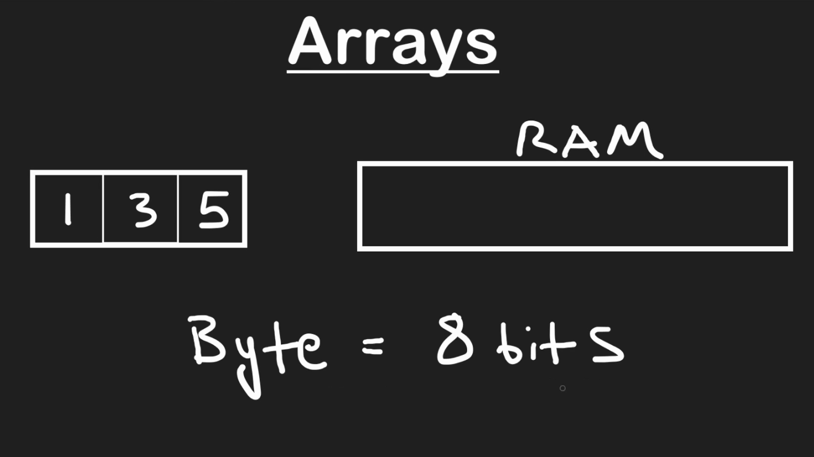
    - understanding RAM 
        - measurement of RAM
            - RAM is measured in bytes
            - common RAM size: 8 gigabytes
        - components of a byte
            - byte consists of 8 bits
            - bit as a position storing 0 or 1
        - formation of RAM
            - bits form bytes, which form RAM
            - RAM stores advanced data structures
- Introduction to Arrays
    - Array of Integers
        - example array containing numbers 1, 3, and 5
        - focus on storing integer 1 in RAM
    - Representation of Integers
        - integers represented by 4 bytes (32 bits)
        - example: integer 1 represented by 31 zeros followed by a single 1
        - 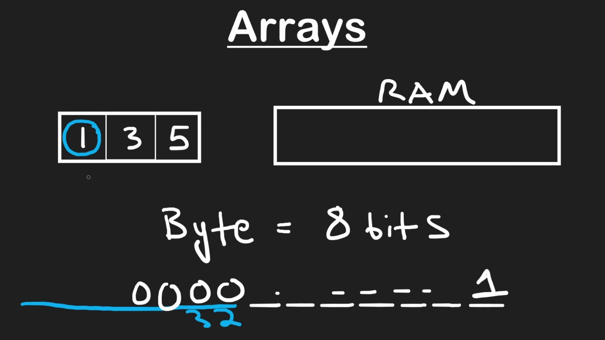
    - Storage in RAM
        - RAM as a contiguous block of data
        - 2 components of RAM: values and addresses
        - Each value stored at a distinct address.
        - addresses prefixed with a dollar sign (for distinguishing from values, optional)
    - Storage of Arrays in RAM
        - arrays stored contiguously in RAM
        - example: values 1, 3, and 5 stored sequentially
        - address increments by 4 for each 32-bit integer
        - 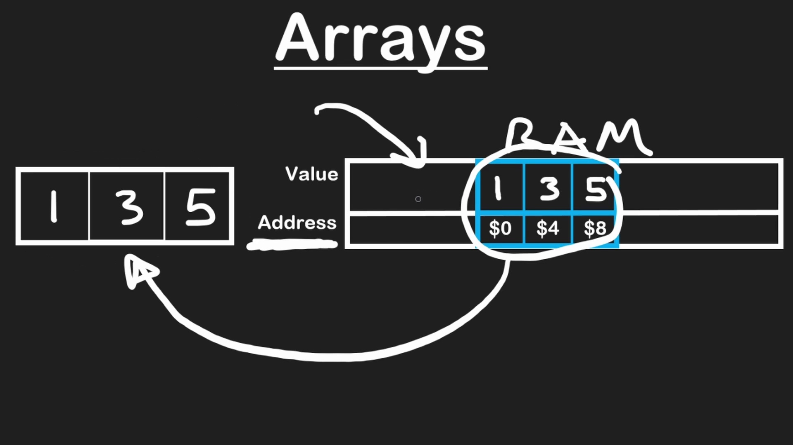
        - character -> eg 'a' -> ASCII value -> address increment by 1 -> 1 byte

#### Static arrays
- 2 common operations of arrays: read and write to the data
    - read operation
        - accessing using index; always starts from 0
        - since we can map every index to an address/location in memory, as long as we know the index, we can access the value in O(1) time
        - O(1) = in the worst case to read a value assuming we know the index, we can access the value in constant time
        - the fact that we can go to any arbitrary address and read the value is a property of RAM and gives the name Random Access Memory
    - add new operation
        - since we can't decide the address of the next value in the array (e.g. the operating system might using the next address to store some other data) neither can we randomly put the value in the memory (as it will destroy the sequential nature of the array) -> biggest limitation of static arrays (i.e. fixed size array)
        - 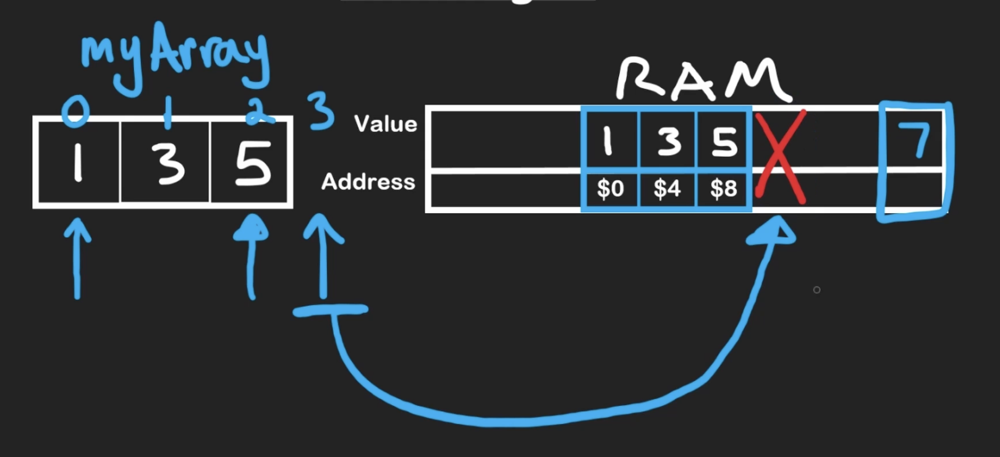
        - static arrays cannot add new elements to the array beyond the fixed size
    - 'remove' operation
        - cannot delete an element from the array
        - can only overwrite the value
        - O(1) time complexity since we know the index
    - write operation
        - write a value at a specific index, O(1) time
    - insert operation
        - worst case is to insert at the start of the array -> O(n) time complexity since we need to shift all the elements to the right
        - 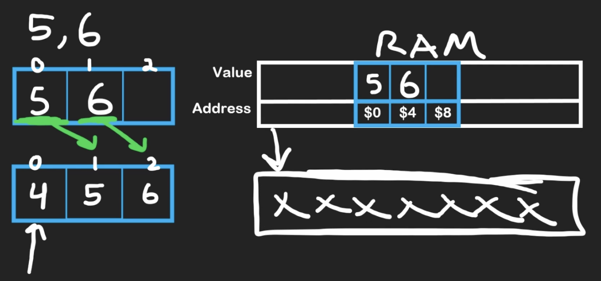
    - remove certain element while maintaining the order of other elements
        - O(n) time complexity since the worst case is to remove the first element, which requires shifting all the elements to the left
        - 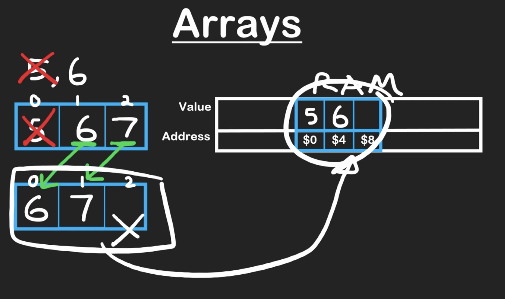
    - summary: 
        - read operation: O(1)
        - write operation: O(1)
        - insert operation: O(n)
        - remove operation: O(n)
        - 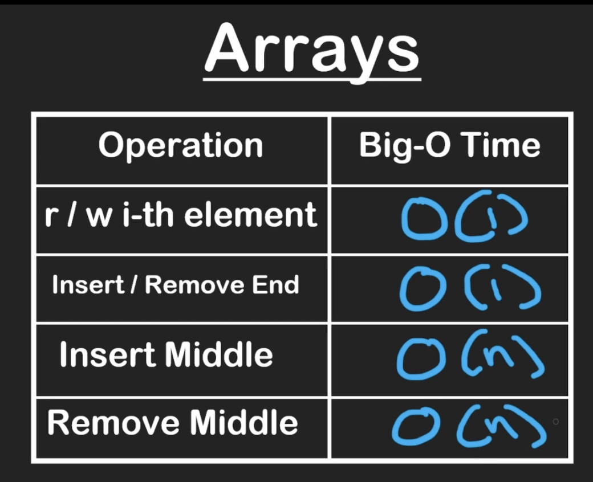

#### Dynamic arrays
- dynamic arrays in different programming languages
    - Python: list
    - Java: ArrayList
    - C++: vector
    - 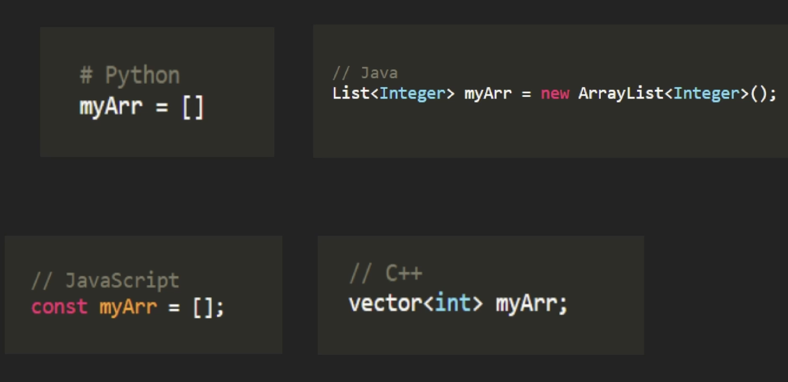
- motivation for dynamic arrays
    - fix the fixed size limitation of static arrays
- properties
    - don't have to initialize the size of the array
        - java default size: 10
        - e.g. define an array that has a default size of 3, while the size is 3, the length is 0
- operations
    - push operations
        - push to the end of the array
        - internal mechanism: have a pointer that points to the last element of the array i.e. the index of the last element; this pointer also indicates the length of the array (i.e. index + 1)
    - pop operation
        - remove the last element of the array
        - O(1) time complexity since there is a pointer that points to the last element
        - make sure to shift the pointer to the previous element
    - push operation when exceeding the size of the array
        - allocate a new array with double the size of the original array that is able to contain all the elements of the original array
        - e.g. array size 3 -> 0 4 7 -> push 9 -> 0 4 7 9 -> new array size 6 -> 0 4 7 9 _ _ -> this size 6 array is going to be somewhere in the RAM, which is unimportant to know where it is, what is important is the sequential nature persists and new elements can be added; note that the location of the size 6 array is not the same as the location of the size 3 array
        - 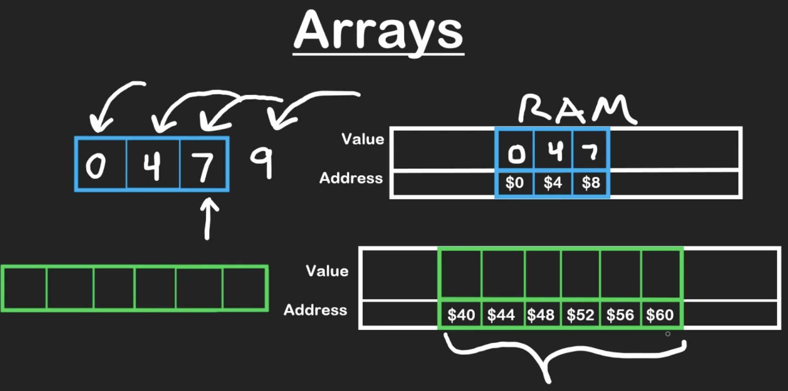
        - we don't need the original array anymore, so we can delete it -> we deallocate the memory of the original array
        - O(n) operation
            - allocating the memory itself is O(n) operation where n is the size of the memory we are allocating
            - copying the elements from the original array to the new array is O(n) operation where n is the length of the original array
            - push the new element (e.g. 9) is O(1) operation
            - 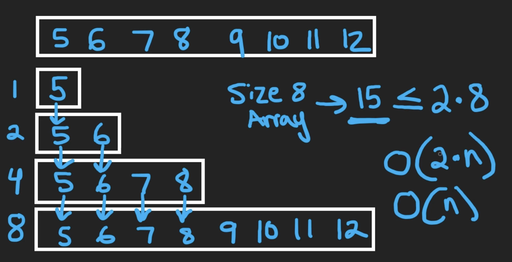
        - every time we exceed the size of the array, time complexity is O(n) rather than a simple push O(1) operation -> this is the trade-off of dynamic arrays -> this is why every time the size of the array is exceeded, we are doubling the size of the array so we don't have to do this operation every single time
        - amortised complexity: average time complexity of an operation over a sequence of operations
            - average time complexity of push operation when the space is exceeded is O(1)
            - this is because it is rather infrequent that the size of the array is exceeded
            - usually is O(1) to push an element to the array
            - so the AVERAGE time complexity of the push operation is O(1) for dynamic arrays
    - summary
        - read operation: O(1)
        - write operation: O(1)
        - insert operation: O(n)
        - remove operation: O(n)
        - 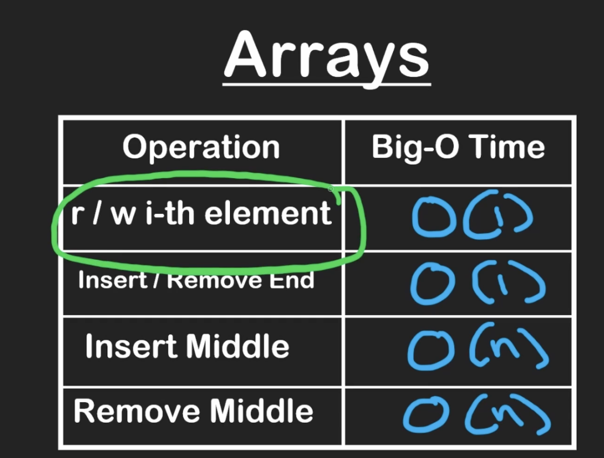

#### Stacks - How we can use arrays
- common data structure, usecase of  arrays
- top of the stack: the end of the array
- 3 typical operations - all O(1) time complexity
    - push: add an element to the end of the stack
    - pop: remove the end element of the stack
    - peek/top: return the end element of the stack
- dynamic array satisfies all the above operations of the stack
- LILO: Last In Last Out
    - e.g. 1 2 3 -> when poping, 3 is removed first, then 2, then 1
    - 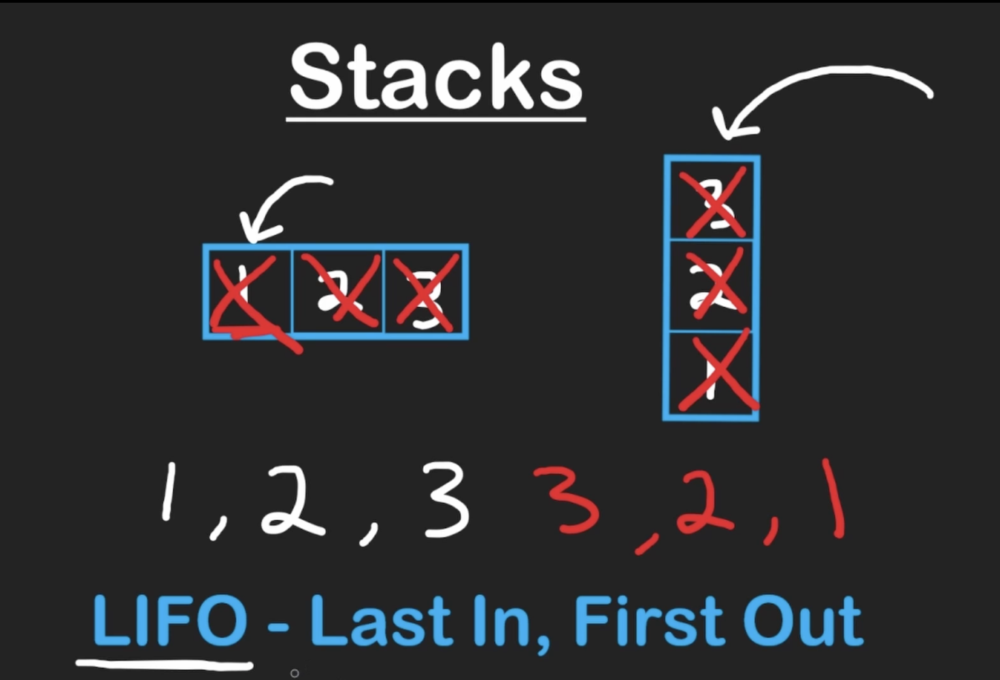